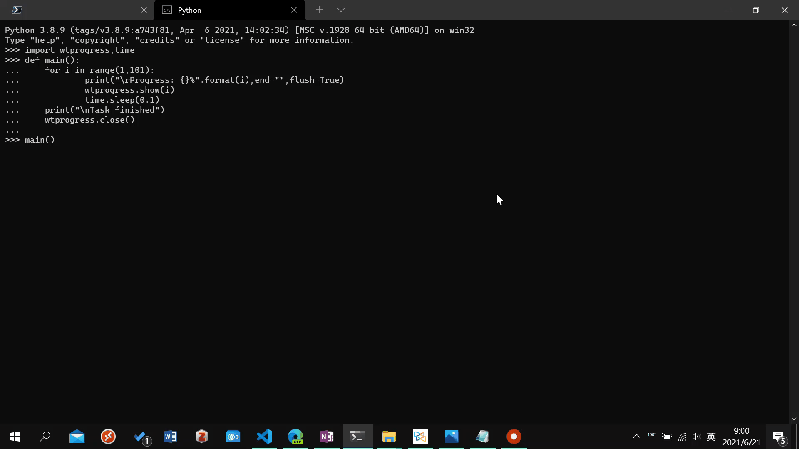

# wtprogress
A python library for showing progress in windows terminal.

When you are running a long-running task in python in background, such as training a neural network, you may switch to your terminal frequently to check the progress. With this library, your python script can show progress in your taskbar, and you can easily see it without switching to your terminal.

Note: this library only supports [Windows Terminal](https://www.microsoft.com/en-us/p/windows-terminal/9n0dx20hk701?activetab=pivot:overviewtab). Conhost doesn't have this feature.

## Example
```py
import wtprogress,time
def main():
    for i in range(1,101):
            print("\rProgress: {}%".format(i),end="",flush=True)
            wtprogress.show(i)
            time.sleep(0.1)
    print("\nTask finished")
    wtprogress.close()
main()
```
